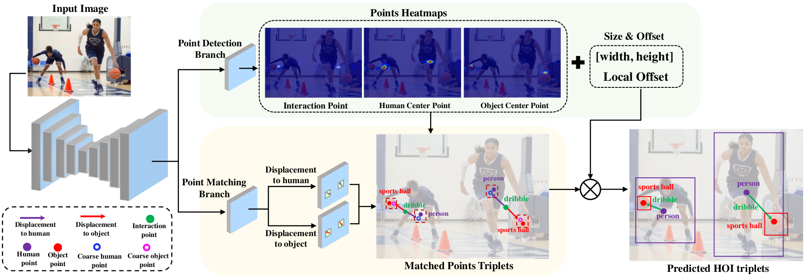

# PPDM
Code for our CVPR 2020 paper "[PPDM: Parallel Point Detection and Matching for Real-time Human-Object
Interaction Detection](https://arxiv.org/pdf/1912.12898)".

Contributed by [Yue Liao](yueliao.github.io), [Si Liu](http://colalab.org/people), Fei Wang, Yanjie Chen, Chen Qian, [Jiashi Feng](https://sites.google.com/site/jshfeng/).



## Checklist
- [x] Training code and test code on HICO-Det dataset. (2020-03-11)
- [x] Training code and test code on HOI-A dataset. (2020-03-11)
- [ ] HOI-A dataset.
- [ ] Image demo.
- [ ] Video demo.
- [ ] PPDM for video HOI detection.
- [ ] PPDM for human-centric relationship segmentation.


## Getting Started
### Installation
1. Clone this repository.

    ~~~
    git clone https://github.com/YueLiao/PPDM.git $PPDM_ROOT
    ~~~
2. Install pytorch0.4.1.

    ~~~
    conda install pytorch=0.4.1 torchvision -c pytorch
    ~~~
3. Install the requirements.
    
    ~~~
    pip install -r requirements.txt
    ~~~
4. Compile deformable convolutional (from [DCNv2](https://github.com/CharlesShang/DCNv2/tree/pytorch_0.4)).

    ~~~
    cd $PPDM_ROOT/src/lib/models/networks/DCNv2
    ./make.sh
    ~~~
### Demo
1. Image Demo

2. Video Demo


## Training and Test
### Dataset Preparation
1. Download [HICO-Det](https://drive.google.com/open?id=1QZcJmGVlF9f4h-XLWe9Gkmnmj2z1gSnk) datasets. Organize them in `Dataset` folder as follows:

    ~~~
    |-- Dataset/
    |   |-- <dataset name>/
    |       |-- images
    |       |-- annotations
    ~~~
2. Download the pre-processed annotations for HICO-Det from the [[websit]](https://drive.google.com/open?id=1WI-gsNLS-t0Kh8TVki1wXqc3y2Ow1f2R) and replace the original annotations in `Dataset` folder. The pre-processed annotations including

    ~~~
    |-- anotations/
    |   |-- trainval_hico.json
    |   |-- test_hico.json
    |   |-- corre_hico.npy
    ~~~
    The `trainval_hico.json` and `test_hico.json` are the "HOI-A format" annotations generated from [iCAN annotation](https://drive.google.com/open?id=1le4aziSn_96cN3dIPCYyNsBXJVDD8-CZ). `corre_hico.npy` is a binary mask, if the `ith category of object ` and the ` jth category of verb` can form an HOI label, the value at location (i, j) of `corre_hico.npy` is set to 1, else 0.

### Training
1. Download the corresponding pre-trained models trained on COCO object detection dataset provided by  [CenterNet](https://github.com/xingyizhou/CenterNet). ([Res18](https://drive.google.com/open?id=1b-_sjq1Pe_dVxt5SeFmoadMfiPTPZqpz), [DLA34](https://drive.google.com/open?id=1pl_-ael8wERdUREEnaIfqOV_VF2bEVRT), [Hourglass104](https://drive.google.com/open?id=1-5bT5ZF8bXriJ-wAvOjJFrBLvZV2-mlV)). Put them into the `models` folder.

2. The scripts for training in `experiments` folder.  An example traning on HICO-DET dataset as follow:

    ~~~
    cd src
    python main.py  hoidet --batch_size 112 --master_batch 7 --lr 4.5e-4 --gpus 0,1,2,3,4,5,6,7  --num_workers 16  --load_model ../models/ctdet_coco_dla_2x.pth --image_dir images/train2015 --dataset hico --exp_id hoidet_hico_dla
    ~~~
### Test
1. Evalution by our rewritten script and select the best checkpoint. The scripts for evalution are put into `experiments` folder.  An example evalution on HICO-DET dataset as follow:

    ```
    cd src
    python test_hoi.py hoidet --exp_id hoidet_hico_dla --gpus 0 --dataset hico --image_dir images/test2015 --test_with_eval
    ```
    
    or directly generating the predictions and evalutating based on our provided checkpoint:
    
    ```
    cd src
    python test_hoi.py hoidet --exp_id hoidet_hico_dla --load_model ../exp/hoidet/hoidet_hico_dla/hoidet_hico_dla.pth --gpus 0 --dataset hico --image_dir images/test2015 --test_with_eval
    ```
    
2. For HICO-DET official evalution.

- Setup HICO-DET evaluation code:

    ~~~
    cd src/lib/eval
    sh set_hico_evalution.sh
    ~~~
- Evaluate your prediction:

    ~~~
    cd src/lib/eval
    python trans_for_eval_hico.py best_predictions.json
    cd ho-rcnn
    matlab -r "Generate_detection.m; quite"
    ~~~
## Results on HICO-DET and HOI-A
**Our Results on HICO-DET dataset**

|Model| Full (def)| Rare (def)| None-Rare (def)|Full (ko)| Rare (ko)| None-Rare (ko)|FPS|Download|
|:---:|:---:|:---:|:---:|:---:|:---:|:---:|:---:|:---:|
|res18| 14.94|	8.83|	16.76|	16.98	|10.42|18.94|**89**|[model](https://drive.google.com/file/d/1L2Ns78F0HD5DRMx68KMyZ1L97ulq5Cwn/view?usp=sharing)|
|dla34| 19.34	|12.21|	21.47	|21.53|	14.14	|23.73|38|[model](https://drive.google.com/open?id=1pNuadiDbHHyAB4kC_II4RKlEOBgKScd6)|
|dla34_3level|19.33	|11.7|	21.61|	21.73|	14.05|	24.03|37|[model](https://drive.google.com/open?id=1wEZ1wgP9vUfm23lr1_t4V7IufCIi3SoZ)|
|dla34_glob|19.42	|13.12|	21.3|	21.76|	15.13|	23.74|38|[model](https://drive.google.com/open?id=15DjWsLR5EA7KejFq6XS4jTkVtJGgRU3M)|
|dla34_glob_3level|19.75	|12.38|	21.95|	22.13|	14.72|	24.35|37|[model](https://drive.google.com/open?id=1CaaDAchPKyh4TYjQIycWERCYerdetR1x)|
|hourglass104|**21.92**|	**15.13**|	**23.95**|	**24.25**|	**17.21**|	**26.35**|14|[model](https://drive.google.com/open?id=1nw2msm437JVfxme5fbdpIFsyZ46S-jtI)|

**Our Results on HOI-A dataset**

Coming soon.

## Citation
Please consider citing this project in your publications if it helps your research. The following is a BibTeX reference. The BibTeX entry requires the url LaTeX package.

~~~
@article{liao2019ppdm,
  title={PPDM: Parallel Point Detection and Matching for Real-time Human-Object Interaction Detection},
  author={Liao, Yue and Liu, Si and Wang, Fei and Chen, Yanjie and Qian, Chen and Feng, Jiashi},
  journal={arXiv preprint arXiv:1912.12898},
  year={2019}
}
~~~
## License
PPDM is released under the MIT license. See [LICENSE](LICENSE) for additional details.
## Acknowledge
Some of the codes are built upon [Objects as Points](https://github.com/xingyizhou/CenterNet) and [iCAN](https://github.com/vt-vl-lab/iCAN). Thanks them for their great works!

